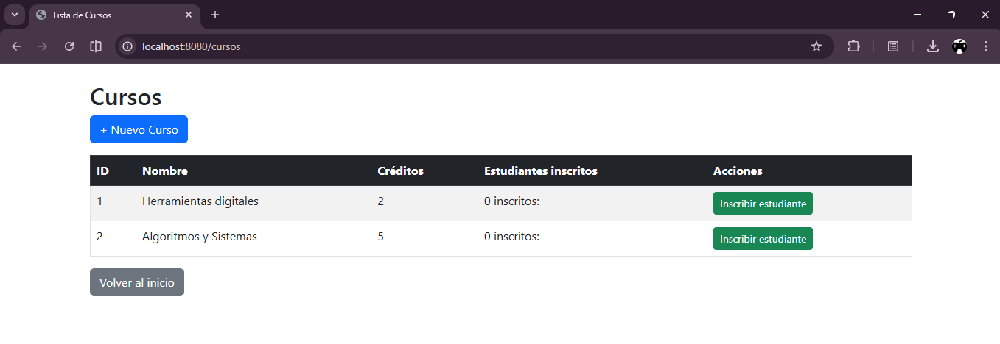
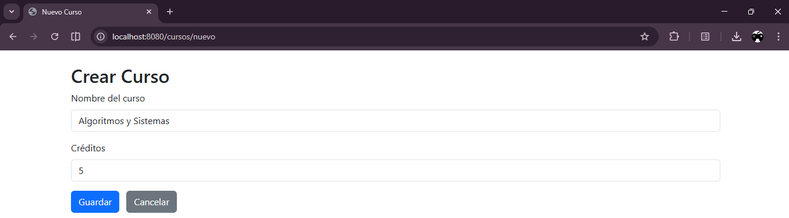
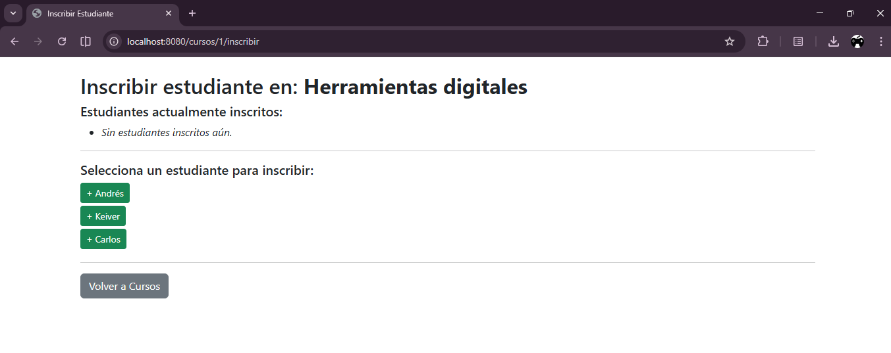
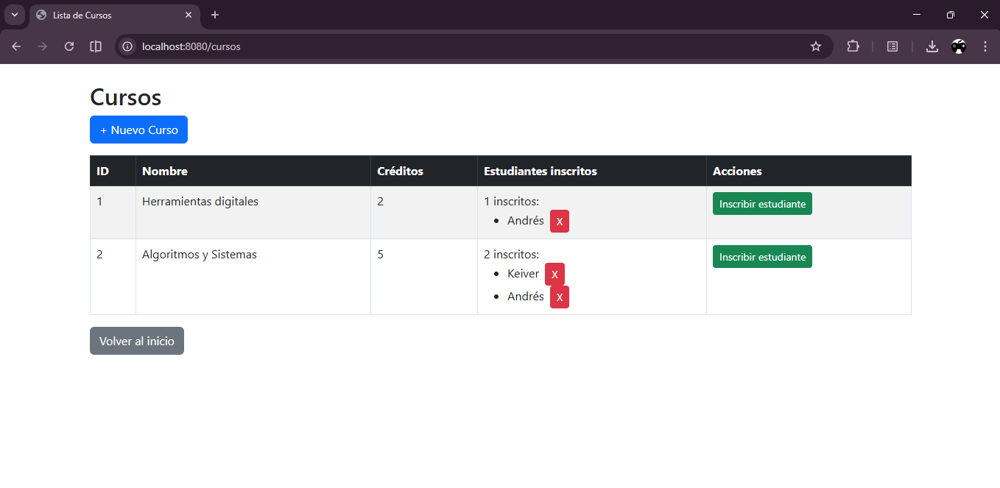

# post2-u8 — Gestión de Cursos y Estudiantes con @ManyToMany

Proyecto Spring Boot que implementa una relación bidireccional `@ManyToMany` entre las entidades `Curso` y `Estudiante` usando Spring Data JPA e Hibernate. Permite registrar inscripciones de estudiantes en cursos mediante una tabla de unión gestionada automáticamente.

---

## Estructura del Proyecto

```
src/
└── main/
    ├── java/com/universidad/estudiantes/
    │   ├── controller/
    │   │   ├── CursoController.java
    │   │   └── EstudianteController.java
    │   ├── model/
    │   │   ├── Curso.java
    │   │   └── Estudiante.java
    │   ├── repository/
    │   │   ├── CursoRepository.java
    │   │   └── EstudianteRepository.java
    │   ├── service/
    │   │   ├── CursoService.java
    │   │   └── EstudianteService.java
    │   └── EstudiantesApplication.java
    └── resources/
        ├── templates/
        │   ├── cursos/
        │   │   ├── lista.html
        │   │   ├── formulario.html
        │   │   └── inscribir.html
        │   └── estudiantes/
        └── application.properties
```

---

## Entidades

### `Estudiante`
| Campo    | Tipo   | Restricciones                        |
|----------|--------|--------------------------------------|
| `id`     | Long   | PK, autoincremental                  |
| `nombre` | String | NOT NULL, máx. 100 caracteres        |
| `email`  | String | NOT NULL, único, válido, máx. 150 ch |

Lado **inverso** de la relación (`mappedBy`): no controla la tabla de unión.

```java
@ManyToMany(mappedBy = "estudiantes")
@JsonIgnore
private Set<Curso> cursos = new HashSet<>();
```

---

### `Curso`
| Campo      | Tipo   | Restricciones                 |
|------------|--------|-------------------------------|
| `id`       | Long   | PK, autoincremental           |
| `nombre`   | String | NOT NULL, máx. 150 caracteres |
| `creditos` | int    | Opcional                      |

Lado **propietario** de la relación: define la tabla de unión `curso_estudiante`.

```java
@ManyToMany
@JoinTable(
    name = "curso_estudiante",
    joinColumns = @JoinColumn(name = "curso_id"),
    inverseJoinColumns = @JoinColumn(name = "estudiante_id")
)
private Set<Estudiante> estudiantes = new HashSet<>();
```

---

## Diagrama ER

```
┌─────────────────┐         ┌───────────────────┐         ┌──────────────────┐
│    estudiantes  │         │  curso_estudiante  │        │      cursos      │
├─────────────────┤         ├───────────────────┤         ├──────────────────┤
│ id (PK)         │◄────────│ estudiante_id (FK) │         │ id (PK)          │
│ nombre          │         │ curso_id (FK)      │────────►│ nombre           │
│ email           │         └───────────────────┘         │ creditos         │
└─────────────────┘                                        └──────────────────┘

  Un estudiante puede estar en muchos cursos.
  Un curso puede tener muchos estudiantes.
  La cardinalidad es N:M gestionada por la tabla de unión curso_estudiante.
```

---

## Configuración y Ejecución

### Prerrequisitos
- Java 17 o superior
- Maven 3.8+
- MySQL 8+

### 1. Crear la base de datos en MySQL

```sql
CREATE DATABASE estudiantes_db;
```

### 2. Configurar `application.properties`

```properties
spring.datasource.url=jdbc:mysql://localhost:3306/estudiantes_db
spring.datasource.username=tu_usuario
spring.datasource.password=tu_contraseña
spring.datasource.driver-class-name=com.mysql.cj.jdbc.Driver

spring.jpa.hibernate.ddl-auto=update
spring.jpa.show-sql=true
spring.jpa.properties.hibernate.dialect=org.hibernate.dialect.MySQLDialect

# Evita revalidación de colecciones en Hibernate 7 al hacer flush
spring.jpa.properties.jakarta.persistence.validation.group.pre-update=
```

### 3. Ejecutar el proyecto

```bash
./mvnw spring-boot:run
```

La aplicación quedará disponible en `http://localhost:8080`.

---

## Endpoints Principales

| Método | URL                                        | Descripción                        |
|--------|--------------------------------------------|------------------------------------|
| GET    | `/cursos`                                  | Lista todos los cursos             |
| GET    | `/cursos/nuevo`                            | Formulario para crear curso        |
| POST   | `/cursos/guardar`                          | Guarda un nuevo curso              |
| GET    | `/cursos/{id}/inscribir`                   | Formulario de inscripción          |
| POST   | `/cursos/{cursoId}/inscribir/{estudianteId}` | Inscribe un estudiante en un curso |
| POST   | `/cursos/{cursoId}/desinscribir/{estudianteId}` | Desinscribe un estudiante      |

---

## Capturas de Pantalla

### Lista de Cursos con Estudiantes Inscritos


### Formulario para Crear un Curso


### Formulario de Inscripción


### Estudiante Agregado a un Curso


---

## Verificación en MySQL

```sql
-- Verificar tablas generadas
SHOW TABLES;

-- Verificar estructura de la tabla de unión
DESCRIBE curso_estudiante;

-- Ver inscripciones registradas
SELECT * FROM curso_estudiante;
```

---

## Notas Técnicas

- La relación bidireccional se sincroniza mediante **helper methods** (`agregarEstudiante`, `quitarEstudiante`) en la entidad `Curso`, que actualizan ambos lados en memoria.
- Las consultas usan `LEFT JOIN FETCH` para evitar el problema **N+1**: en lugar de una consulta por cada curso para obtener sus estudiantes, se obtiene todo en una sola consulta SQL.
- Se usa `@JsonIgnore` en `Estudiante.cursos` para evitar referencias circulares en la serialización JSON.
- La inyección de dependencias se realiza por **constructor** en todos los servicios y controladores.